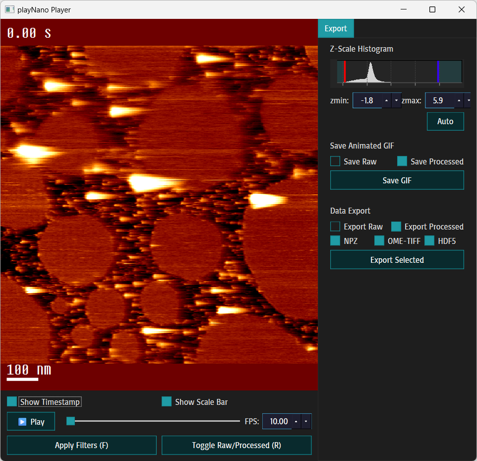

<!-- markdownlint-disable MD033 -->
# 📽️ playNano

**AFM Video Reader for `.h5-jpk` files and other high-speed AFM video formats**

<div align="center">

[](https://www.python.org/)
[](LICENSE)

[](https://github.com/astral-sh/ruff)
[](https://github.com/psf/black)
[](https://github.com/psf/flake8)
[](https://codecov.io/github/derollins/playNano)

</div>

**playNano** is a Python tool for loading, filtering, visualising, and exporting time-series AFM data,
such as high-speed AFM (HS-AFM) videos. It supports interactive playback, flexible processing pipelines,
and provenance-aware analysis tracking, and export in multiple formats, including OME-TIFF, NPZ (NumPy zipped archive),
HDF5 bundles, and animated GIFs.

**Files read:**
<div align="center">

**`.h5-jpk`, `.jpk`, `.asd`, `.spm`**

</div>

This project requires Python 3.10 or newer and is in development. If you find any issues, please open an issue at:
<https://github.com/derollins/playNano/issues>

Questions? Email: <d.e.rollins@leeds.ac.uk>

Full documentation (Sphinx): `docs/` (built HTML in `docs/_build/html`).

📜 [Changelog](https://derollins.github.io/playNano/changelog.html)

---

## ✨ Features

- 📂 **Extracts AFM time-series (video) data** from `.h5-jpk` and `.asd` files and folders of `.jpk` and `.spm` files.
- ▶️ **Animated video viewer**, an interactive PySide6 viewer with playback, z-scale configuration, and export tools.
- 🪟 **Processing pipeline** (filters + masks) that records per-step provenance.
- 📏 **Analysis pipeline** for detection/tracking; stores outputs and provenance in the stack.
- 📩 **Exports** to OME-TIFF stacks, NPZ bundles, HDF5 bundles, and annotated GIFs..
- 🔌 **Plugin system** for custom filters.

---

## 📦 Installation and Dependancies

Requires Python 3.10–3.12.

Clone the repository into a new folder:

```bash
git clone https://github.com/derollins/playNano.git
cd playNano
```

It is recommended to use a virtual environment. Then install in editable mode:

```bash
pip install -e .
```

Key dependencies (install via pip install -e .): numpy, h5py, Pillow, matplotlib,
scipy, scikit-learn, python-dateutil, tifffile, AFMReader (optional).

## 🚀 Quickstart

**Play a file (GUI):**

```bash
playnano play path/to/sample.h5-jpk
```

This opens an interactive window that can be used to veiw the videos and configure
formatting for the display and GIF exports.
Press the **f** key to flatten with default steps.

**Batch process + make GIF:**

```bash
playnano process path/to/sample.h5-jpk \
  --processing "remove_plane;gaussian_filter:sigma=1.0" \
  --export tif,npz --make-gif --output-folder ./results
```

See the full docs for the complete CLI reference, GUI guide, filters, YAML schemas,
and examples.

## ⌨️ CLI Usage

### General  Structure

```bash
playnano <command> <input_file> [options]
```

Commands:

- `play`: Launches the interactive viewer.
- `run`: Batch processing mode for applying filters and exporting.
- `wizard`: Open interactive processing wizard for applying filters and exporting.

### 👟 Command Line mode (`run`)

Apply filters and export without interaction.

```bash
playnano run /path/to/afm_file.h5-jpk \
  [--channel CHANNEL] \
  [--processing [PROCESSING_STEPS_STR] or [--processing-file [PATH_TO_PROCESSING_YAML] \
  [--export tif,npz,h5] \
  [--make-gif] \
  [--output-folder OUTPUT_DIR] \
  [--output-name BASE_NAME]
  [--scale-bar-nm SCALE_BAR_INT]
  [--zmin MINIMUM_Z_SCALE_VALUE]
  [--zmax MAXIMUM_Z_SCALE_VALUE]

```

- `--channel`: (default: `height_trace`): Channel to load.

- `--output-folder`: Directory to write exports and/or GIF (default: ./output).

- `--output-name`: Base filename for output files (no extension).

- `--export`: Comma-separated list of formats to export (tif, npz, h5).

- `--make-gif`: Write an animated GIF after filtering.

- `--scale-bar-nm`: Length of scale bar annotation on GIF animation in nm. Set to 0 to remove sacle bar.

- `--processing`: Semi-colon-separated list of filters and masks to apply in order (see Flattening section
                  below), with parameters seperated with a colon.
                  I.e. "remove_plane;mask_mean_offset:factor=1;row_median_align;clear;gaussian_filter"

- `--processing-file`:  An alternative processing input feild which takes a yaml file listing filtering
                        steps and parameters.

- `--zmin`: Minimum Z-value to map to colormap 0. Can also be 'auto' in which case it becomes the value of the
            first percentile of the entire stack.

- `--zmax`: Maxium Z-value to map to colormap 255. Can also be 'auto' in which case it becomes the value of the
            99th percentile of the entire stack.

> Expected YAML schema:

 ```yaml
    filters:
    - name: remove_plane
    - name: gaussian_filter
        sigma: 2.0
    - name: threshold_mask
        threshold: 2
    - name: polynomial_flatten
        order: 2
```

### 🧙‍♂️ Interactive Wizard mode (`wizard`)

Launches an interactive REPL for building and executing processing pipelines.

Takes ``--channel``, `--output-folder`, `--output-name` and `--scale-bar_nm` flags as above.

```bash
playnano wizard /path/to/afm_file.h5-jpk \
  [--channel CHANNEL] \
  [--output-folder OUTPUT_DIR] \
  [--output-name BASE_NAME]
  [--scale-bar-nm SCALE_BAR_INT]
```

Use `help` to see a list of calls.

Start my using the `add` call followed by the name of a filter or mask to add a processing step, the REPL will ask
for paramters if required. Once a few steps have been added use `list` to see the pipeline, `save` followed by a path
to a `.yaml` file to save the pipeline for use with the `--processing-file` flag and `run` to execute the processes.
      add remove_plane
      add gaussian_filter
        sigma: 2.0
      list
      run
      quit

Once run, the REPL will ask you about exporting the processed data and generating GIF animiations.
These will be save to the `--output-dir` set at initlization and as the `--output-name`.

Use `quit` to exit the wizard early.

### 🖥️ Interactive Playback mode (`play`)

Opens a modern PySide6 GUI for browsing, filtering, and exporting AFM stacks.

Key elements:
– Playback controls: play/pause, FPS slider, and current frame indicator.
– Annotation toggles: timestamps and scale bar.
– Z‑scale histogram: two draggable vertical lines for zmin/zmax with “Auto” reset and spin boxes.
– Export panel: select formats (OME‑TIFF, NPZ, HDF5, GIF) and export current raw or processed data.

<p align="center">
  
</p>

The window is initilized with similar flags to the `run` mode without the `--export` or `--make-gif` flags
(these are controled within the GUI.)

```bash
playnano play /path/to/afm_file.h5-jpk \
  [--channel CHANNEL] \
  [--processing [PROCESSING_STEPS_STR] or [--processing-file [PATH_TO_PROCESSING_YAML] \
  [--output-folder OUTPUT_DIR] \
  [--output-name BASE_NAME] \
  [--scale-bar-nm SCALE_BAR_INT]
  [--zmin MINIMUM_Z_SCALE_VALUE]
  [--zmax MAXIMUM_Z_SCALE_VALUE]

```

The `--zmin` and `--zmax` flags define the initial Z colour scale of the window and GIF exports. The
value can be either a float or the string, 'auto', to set the values as the 1st and 99th percentiles
of the data respectively; this is the default behaviour. These values can be changed interactivly within
the window.

**Viewer key bindings:**

Press keys to inteact with the video viewing window:

Apply filter:

- **f** — Apply filtering and update view.
- **r** — Toggle between raw and filtered data.

Save and export:

- **e** — Export the current data (raw or processed as set in the export panel) in the selected formats, either
  OME-TIF (.ome.tif), loadable in many image analysis programmes, a NumPy zipped archive (.npz), or a HDF5
  bundle (.h5).
- **g** — Export the data as an animated GIF with the annotations in the viewer (scale bar and timestamps).

> 📝 Note: Both raw and processed data can be exported - this es selected in the export panel.

## 🪟 Flattening

### Filters

- **Remove Plane** (remove_plane): Fit a 2D plane to the image with inear regression and subtract it.

- **Polynomial Flatten** (polynomial_flatten): Fit and subtract a 2D polynomial of given order to remove slow surface trends.

  > Polynominal calculated from unmasked data if present. Parameter: Order(Int) default set to 2.

- **Row Median Align** (row_median_align): Subtract the median of each row from that row to remove horizontal banding.

  > Polynominal calculated from unmasked data if present.

- **Zero Mean** (zero mean): Subtract the overall mean height to center the background around zero.

  > Mean calculated from unmasked data if mask is present.

- **Gaussian Filter** (gaussian_filter): Apply a Gaussian low-pass filter to smooth high-frequency noise.

  > Parameter: Sigma(float) default set to 1 pixel.

### Masks

- **Mask with threshold** (mask_threshold): Mask data above a threshold.

> Parameter: Threshold(float) default set to 0.0.

- **Mask below threshold** (mask_below_threshold): Mask data below a threshold.

> Parameter: Threshold(float) default set to 0.0.

- **Mask with mean offset** (mask_mean_offset): Mask data above the mean +/- (s.d. * factor).

> Paramter: Factor(float) deafult set to 1.0.

- **clear** resets mask.

> N.B. Mask are overalyed on each other unless cleared by using the "`clear`" command.

### 🧩 Filter Plugins

You can extend playNano by installing third-party filter plugins via entry points under playNano.filters. Edit the
`[project.entry-points."playNano.filters"]` section of the pyproject.toml file like this:

```toml
[project.entry-points."playNano.filters"]
other_filter   = "playNano.processing.filters:other_filter"
my_new_plugin  = "mylibrary.moldule:my_new_plugin"
```

These become available in the CLI filter lists automatically.

Plugins must have the format:

```python
def filter_plugin(2Ddata: np.ndarray, **kwargs) -> np.ndarray:
```

## 📟 Outputs

Once loaded you can export AFM stacks in the following formats:

| Format   | Description                                | Extension  |
| -------- | ------------------------------------------ | ---------- |
| OME-TIFF | Multi-frame TIFF for image analysis        | `.ome.tif` |
| NumPy    | Zipped archive of array + metadata         | `.npz`     |
| HDF5     | Self-contained AFM stack bundle            | `.h5`      |
| GIF      | Animated GIF with scale bar and timestamps | `.gif`     |

- Use `--output-folder` and `--output-name` to customize where and how files are saved.
- Defaults:

  - Folder: `./output/`
  - Name: derived from input filename (with `_filtered` suffix if filters were used)

## 🔍 Analysis Pipeline (Advanced)

If using custom analysis modules:

```bash
from playNano.analysis.pipeline import AnalysisPipeline

pipeline = AnalysisPipeline()
pipeline.add("detect_particles", threshold=5)
pipeline.add("track_particles", max_distance=3)

record = pipeline.run(stack, log_to="analysis.json")
```

Each step is recorded with:

- Module name and parameters

- Execution timestamp

- Optional version info

- Analysis output (in stack.analysis)

- All metadata in stack.provenance["analysis"]

## Logging Level

Control verbosity with:

```bash
--log-level {DEBUG,INFO,WARNING,ERROR}
```

Default is `INFO`.

## 🧪 Examples

Interactive playback (`play`) with filters and export folder:

```bash
playnano play sample.h5 --processing "remove_plane;mask_mean_offset:factor=1;row_median_align" \
                        --output-folder ./gifs \
                        --output-name sample_view
```

Batch run (`run`) with filtering steps set by processiing yaml file, exporting OME-TIFF and NPZ bundles, plus GIF:

```bash
playnano run sample.h5 \
--processing-file my_filter_steps.yaml \
--export tif,npz \
--make-gif \
--output-folder ./results \
--output-name sample_processed
```

## ⚠️ Notes

- Make sure the input file includes valid metadata like line_rate, or GIF generation may fail.

- If --channel is incorrect or missing from the file, you’ll receive an error.

- For .h5-jpk and other multi-frame formats, a single file is loaded. For formats like .jpk or .spm, provide a folder
    containing the frame files.

## Examples

- `notebooks/playnano_demo_notebook.ipynb`: step‑by‑step demo of loading, processing, analysing, and exporting time-series
 AFM data with playNano.

Install playNano using `pip install .[notebooks]` to include the `jupyter` dependancy.

## 📁 Project Structure

```text
playNano/
├── afm_stack.py       # Core AFM stack object
├── analysis/          # Analysis pipeline & modules
├── processing/        # Filters, masks, and processing logic
├── io/                # File I/O loaders and writers
├── cli/               # CLI interface
├── playback/          # OpenCV-based viewer
├── utils/             # Common utilities
└── notebooks/         # Example and demostration notebooks
```

## 🧩 Dependencies

Requires Python 3.10, 3.11 or 3.12.

This project requires the following Python packages:

- `numpy`
- `h5py`
- `Pillow`
- `matplotlib`
- `opencv-python`
- `scipy`
- `scikit-learn`
- `python-dateutil`
- `tifffile`
- [`AFMReader`](https://github.com/AFM-SPM/AFMReader) — for reading `.jpk`, `.spm` and `.asd` files


## 🤝 Related Software

These are some software packages that have helped and inspired this project:

### [Topostats](https://github.com/AFM-SPM/TopoStats)

A general AFM image processing programme written in Python that batch processes AFM images.
Topostats is able to flatten raw AFM images, mask objects and provides advanced analysis tools
including U-net based masking.

### [AFMReader](https://github.com/AFM-SPM/AFMReader)

Spun out of Topostats, AFMReader is Python library for loading a variety of AFM file formats. It opens
each as a tuple containing a NumPy array and a float referring to the planar pixel to nanometer convertion
factor. Within playNano this library is used to open the folder-based AFM video formats.

### [NanoLocz](https://github.com/George-R-Heath/NanoLocz)

A free MATLAB app with an interactive GUI that is able to load, process and analyse AFM images and
high-speed AFM videos. Featuring mask analysis, particle detection and tracking, it also
integrates Localization  AFM [(L-AFM)](https://www.nature.com/articles/s41586-021-03551-x).

## 📜 License

This project is licensed under the [GNU General Public License v3.0 (GPLv3)](https://www.gnu.org/licenses/gpl-3.0.html)

## Included Fonts

This project bundles the following fonts:

- **Steps Mono** by [Velvetyne Type Foundry](https://velvetyne.fr/fonts/steps-mono/),
  licensed under the SIL Open Font License 1.1.

- **Basic** by [Eben Sorkin](https://github.com/EbenSorkin),
  licensed under the SIL Open Font License 1.1.

Full license texts and attribution are provided in:

- `src/playNano/fonts/Steps-Mono/LICENCE.txt`
- `src/playNano/fonts/Basic/LICENCE.txt`

